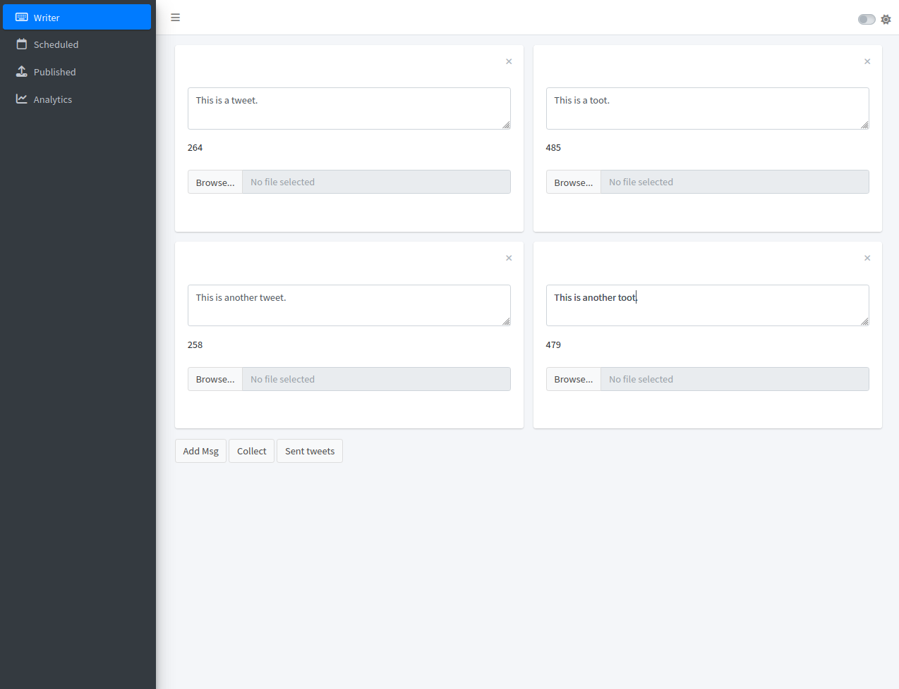

# Tweets and Toots

This is the repo I will use to build a Shiny app that let's me schedule threads on both, Twitter and Mastodon.

## Current Status

A basic UI has been implemented that let's the user write threads of tweets and toots side by side.
Currently, new messages can be added to the thread by clicking "Add Msg".
Messages can be collected using the "Collect" button.
After collection, the messages are printed into the console (current status only).

Twitter threads (currently without media) can be send by clicking the "Sent tweets" button.
Right now this posts to a [dummy Twitter account](https://twitter.com/test12376118316).
Currently, authentication works by loading a .rds-file from the working directory (this file is not pushed to GH).
In the future, there will be a sign-in form in the UI to connect your Twitter/Mastodon accounts (but I need to figure out safe storage of authentication files first).

Next update: I'll continue development when I get back from vacation after January 15.

## Roadmap

### General

- Create a {renv}-controlled {golem} app for project

### UI

- Allow multiple image uploads
- Use separate amount of tweets and toots (maybe?)
- ~~Fix automatic text area height adjustment for second row of text cards~~
- Make theme pretty with {fresh} or {bslib}
- Figure out why message collection does not work in RStudio web browser (currently low priority since it works in Firefox and Chrome)
- Allow emoji input by typing `:`
- Twitter and Mastodon sign-in from UI

### Backend

- Create backend functions to interact 
    - with Twitter (`{rtweet}`)
      - ~~Send threads without media~~
      - Use JS code to grab correct order of media uploads and get image paths from there to allow media in tweets
    - Mastodon API (`{rtoot}`)
- Use Twitter/Mastodon sign-in via UI to save authentication files 
- Figure out how to store data permanently (after closing app)
- Figure out how to schedule tasks (i.e. schedule thread to be published as specified time)

